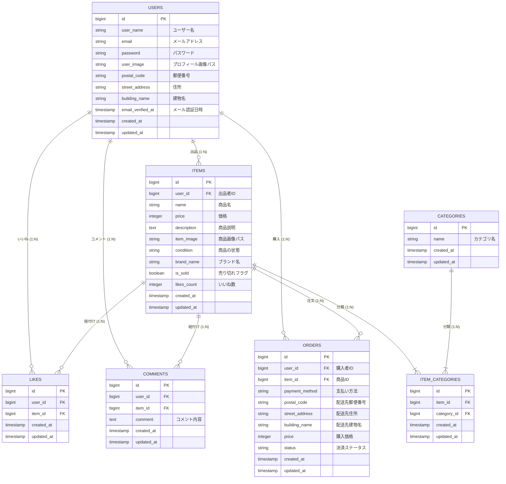

## 機能一覧

本アプリは以下の主要な機能を提供します。

1. 認証機能
   会員登録、ログイン、ログアウト機能。
   メール認証機能: 新規会員登録後、メール認証誘導画面へ遷移し、メール内のリンクをクリックすることで認証が完了します。認証完了後にプロフィール設定画面へリダイレクトします。
   バリデーション: 全ての認証関連フォームでForm Requestによる入力検証が行われます。
2. 商品関連
   商品一覧表示: 全ての商品を一覧表示します。購入済み商品は「SOLD」と表示され、ログインユーザー自身が出品した商品は表示されません。
   商品詳細表示: 商品画像、商品名、ブランド名、価格、いいね数、コメント数、商品説明、カテゴリ、商品の状態、コメント一覧、コメント投稿フォームが表示されます。
   商品検索: ヘッダーの検索窓から商品名で部分一致検索が可能です。検索状態はタブ切り替え後も保持されます。
   商品出品: 商品名、商品説明、画像、カテゴリ（複数選択可）、商品の状態、価格、ブランド名を入力して商品を出品できます。画像はLaravelのStorageに保存されます。
3. ユーザーインタラクション
   いいね機能: 商品にいいねを付けたり解除したりできます。いいね数はリアルタイムで更新されます。
   コメント機能: ログインユーザーは商品にコメントを投稿できます。コメント数も表示されます。
   マイリスト機能: ログインユーザーがいいねした商品だけを一覧表示できます。
4. 購入機能
   購入手続き: 商品詳細ページから購入手続き画面へ遷移し、支払い方法（カード、コンビニ）を選択して購入を確定します。
   Stripe決済: 「購入する」ボタン押下後、Stripe Checkoutへ遷移し、安全に決済を行うことができます。決済完了後、商品は「SOLD」状態になり、購入履歴に追加されます。
   配送先変更: 購入手続き画面から配送先住所変更画面へ遷移し、登録済みの住所情報を更新できます。
5. ユーザー管理
   マイページ: ログインユーザーのプロフィール情報（画像、ユーザー名）と、出品した商品一覧、購入した商品一覧が表示されます。
   プロフィール編集: プロフィール設定画面で、プロフィール画像、ユーザー名、郵便番号、住所、建物名を更新できます。
   環境構築 (Docker Compose)
   このプロジェクトはDocker Composeを使用して開発されています。

## 前提条件

Docker Desktop がインストールされていること
Docker Compose がインストールされていること

## データベース設計 (ER図)



## セットアップ手順

1.プロジェクトのクローン

```bash
git clone https://github.com/junya-enomoto/Mock_case.git
cd Mock_case/src
```

2.'.env' ファイルの作成

.env.example をコピーして .env ファイルを作成し、環境変数を設定します。

```bash
cp .env.example .env
```

APP_KEY を生成します。

```bash
docker-compose run --rm php php artisan key:generate
```

3.Docker Compose の設定
docker-compose.yml ファイルに、PHP、Nginx、MySQL、Mailhog などのサービスが定義されています。

4.Docker コンテナのビルドと起動

```bash
docker-compose up -d --build
```

5.Composer パッケージのインストール
PHPコンテナ内で実行します。

```bash
docker-compose exec php composer install
```

6.データベースのセットアップ
マイグレーションを実行し、テーブルを作成します。開発用のダミーデータも投入します。

```bash
docker-compose exec php php artisan migrate:refresh --seed
```

7.storage:link の作成
画像アップロード機能のためにシンボリックリンクを作成します。

```bash
docker-compose exec php php artisan storage:link
```

8.アプリケーションへのアクセス
ブラウザで http://localhost (または .env の APP_PORT に応じたポート) にアクセスします。

Mailhog のWeb UI: http://localhost:8025
テスト (PHPUnit)
本プロジェクトはPHPUnitを用いてテストが実装されています。

## テスト環境の構築

1.テスト用データベースの作成
ターミナルやMySQLクライアントから、テスト専用のデータベースを作成します。

```sql
CREATE DATABASE laravel_test;
```

2.'.env.testing' ファイルの作成
.env ファイルをコピーして .env.testing を作成し、DB接続情報をテスト用DBに書き換えます。

```bash
cp .env .env.testing
```

./env.testing の中身を以下のように変更してください。

```env
DB_DATABASE=laravel_test
# DB_HOST, DB_USERNAME, DB_PASSWORD は .env と同じでOK
```

## テストの実行

プロジェクトルートディレクトリで、PHPコンテナ内でテストを実行します。

```bash
docker-compose exec php php artisan test
```

特定のテストファイルのみを実行する場合:

```bash
docker-compose exec php php artisan test tests/Feature/AuthTest.php
```

## 補足

Stripe決済: 実際の決済処理はStripeのテスト環境を使用します。StripeアカウントのAPIキーを .env に設定する必要があります。
メール認証: 開発中はMailhogを使用してメールの送受信を確認できます。
